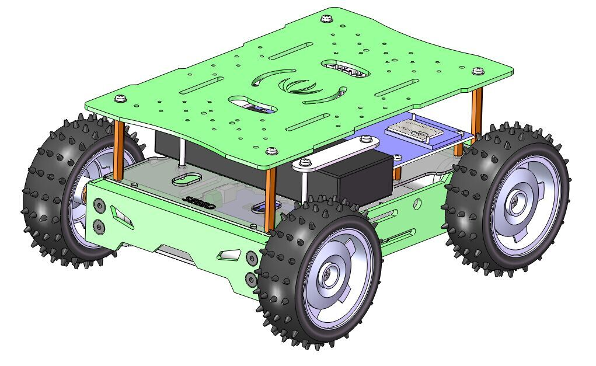

Edison WiFi Car
===============

To build WiFi Car with Intel Edison and Seeed Skeleton Bot.



## Hardware
+ Intel Edison + Arduino Breakout
+ [Skeleton Bot](http://www.seeedstudio.com/wiki/Skeleton_Bot_-_4WD_hercules_mobile_robotic_platform)
+ [Grove - I2C Motor Driver](http://www.seeedstudio.com/wiki/Grove_-_I2C_Motor_Driver_V1.3)
+ [Base Shield](http://www.seeedstudio.com/wiki/index.php?title=Base_shield_v2&uselang=en)

Connect the Grove - I2C Motor Driver to Base Shield's D8 Grove connector.

## Software
### Requirements
+ libmraa0 (tested with v0.5.4)

### Usage
Download this repository to Edison and run:
```
cd {REPO_DIR}
./run.sh
```
Connect to the Edison WiFi network and open 192.168.42.1 in your web browser.

### Create an ipk
Just run `make`, wificar.ipk will be created.
```
cd {REPO_DIR}
make
```
Then copy wificar.ipk to Edison and run:
```
opkg install wificar.ipk
systemctl start wificar.service   # start wificar
systemctl enable wificar.service  # autorun wificar at startup
```

----

This software in this repository is written by [Seeedstudio](http://seeed.cc)<br>
and is licensed under [The MIT License](http://opensource.org/licenses/MIT).

Contributing to this software is warmly welcomed. You can do this basically by<br>
[forking](https://help.github.com/articles/fork-a-repo), committing modifications and then [pulling requests](https://help.github.com/articles/using-pull-requests) (follow the links above<br>
for operating guide). Adding change log and your contact into file header is encouraged.<br>
Thanks for your contribution.

Seeed Studio is an open hardware facilitation company based in Shenzhen, China. <br>
Benefiting from local manufacture power and convenient global logistic system, <br>
we integrate resources to serve new era of innovation. Seeed also works with <br>
global distributors and partners to push open hardware movement.<br>

[](https://github.com/igrigorik/ga-beacon)
